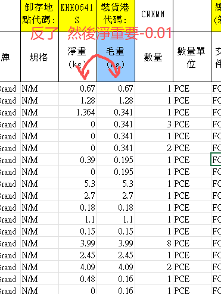
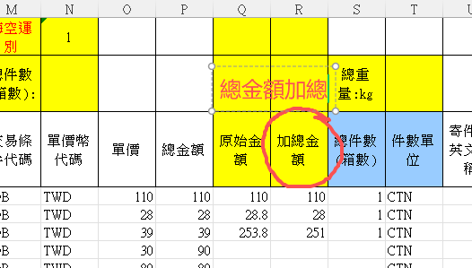
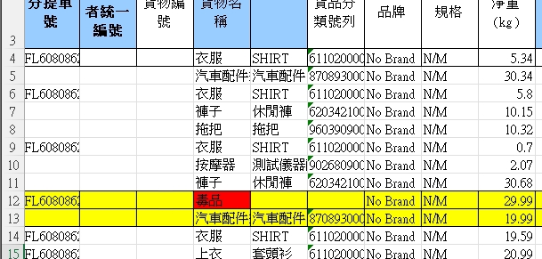
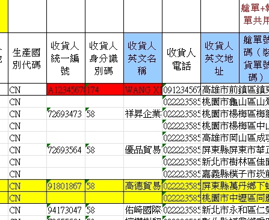

# 客戶QA回報

## 1. 高雄超峰重量
### 敘述
高雄超峰重量部分  值是反的  然後  淨重要-0.01
### 截圖
示意圖 

## 2. 高雄超峰  R欄位部分
### 敘述
高雄超峰  R欄位部分  圈起來的固定格式 幫我改成  "總金額加總"
### 截圖
示意圖 

## 3. 台北港格式 需求的第二點
### 敘述
台北港格式 需求的第二點  "總金額加總為平分回單價"
### 截圖
示意圖 

## 4. UI介面  
### 敘述
這個按鈕名稱  改成 "沛寶.速派格式"
### 截圖
示意圖 

## 5. 天馬格式 地址欄位
### 敘述
天馬格式 ->  地址欄位也要套雲端

## 6. 欄位標紅行為修正
### 敘述
就是你現在  問題件 跟 收貨人有標註的  會整條標紅
能不能像這樣  只單欄位標紅

## 7. 自動分艙功能修正 

### 敘述
他跟一開始資料轉換的格式會不一樣

所以你格式可能要重新設定   我這邊再提供給你
(自動分艙單號功能  應該要有一個自己的按鈕) "因為格式不同"

我用舊格式去測的時候   分艙單號沒有跑出來

示意檔案 
docs\new-feature-1207\client-qa\亂超峰326.xlsx 

編分艙號會是最後的動作 
不能一開始就用

### 開發補充

用戶的意思是自動分艙不能在轉換過程用勾選的使用,用戶把檔案匯出會再做一次處理,最後才會把處裡的內容丟進系統再轉換,如果是用勾選的等於會做兩次轉換會把資料轉壞,所以需要要一個單獨的按鈕只用於分艙.