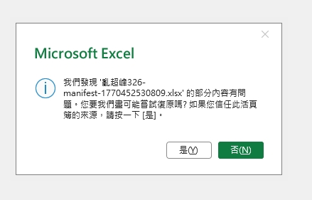
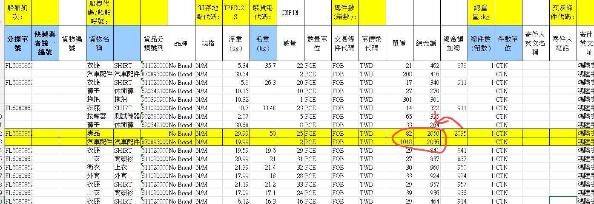

# 客戶QA回報

## 1. 超峰問題 - 匯出檔案/艙單編號相關問題
### 敘述
1. 用戶點擊出匯出的檔案出現 `我們發現 XXXXX 的部分內容有問題...` 詳見截圖
2. 超峰問題  AG  跑到  AC   倉號一樣沒出來
### 截圖
1. 問題一的示意圖 
2. 問題二的示意圖 
### 補充
用戶提供了原始的 excel docs\new-feature-1207\client-qa-20260209\example\亂超峰326.xlsx
轉換完的 excel docs\new-feature-1207\client-qa-20260209\example\亂超峰326.xlsx 
可以參考 AA 以及 AC 的差異,在每一組的第一格要放入艙單編號(AA), AG 同一組則是放入該組相同的編號

## 2.  高雄超峰 - 淨重問題
### 敘述
1. 淨重對了　但毛重不能動（不能往下攤）

## 3.  台北港格式 - 總金額問題
### 敘述
1. 台北港格式  總金額加總要均攤回去 (如有2項)  不能單項  
這樣金額不對
### 截圖
1. 問題一的示意圖 

