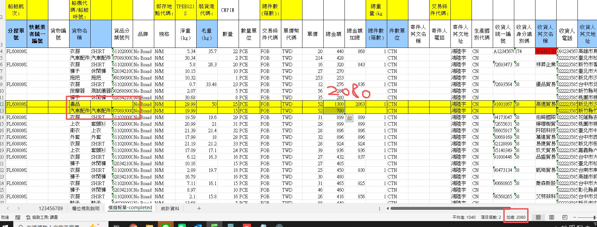
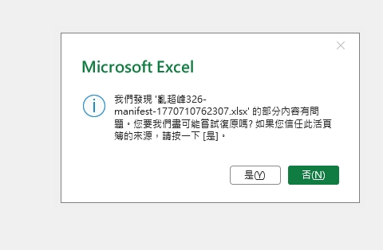
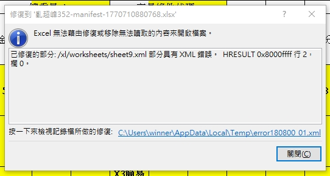

# 客戶QA回報

## 1. 台北港格式 - 總金額問題
### 敘述
總金額回攤後,加總和總金額加總不同,每一個品項回攤金額要和總金額一樣。

### 截圖


### 補充
我們的其他表單應該有類似的回攤處裡,你可以參考其他的處裡,原則上該群組品項的金額加起來一定要等於總金額加總。

## 2. 問題件異常

### 敘述
問題件沒有被找出標紅。


### 截圖


### 補充
表單上的問題件設定:

```
貨物名稱
電子煙
仿冒品
毒品
槍械零件
管制藥品
```

## 3. 高雄超封  淨重問題

### 敘述
用戶敘述:淨重沒有攤   然後要-0.1   像我打勾那樣

意思是淨重要分到每個品項中,然後 -0.01

假如兩品項  0.39/2 = 0.19
每一個項目-0.01 所以每一個品項應該要是 0.189


## 4. 艙單編號 - 檔案錯誤問題

### 敘述
用戶點擊出匯出的檔案出現 `我們發現 XXXXX 的部分內容有問題...` 詳見截圖 `1770710798246.jpg`
用戶點下修復後檔案內容看起來正常,但體驗會很奇怪,用戶會擔心內容跑掉,修復的截圖請參考
然後只有艙單編號的按鈕會有此問題,其他按鈕沒有問題

### 截圖
excel 問題彈窗截圖


excel 修復後截圖



## 5. 艙單編號按鈕新功能,忽略編號 0 checkbox

### 敘述
由於艙單編號用戶希望能夠忽略所有編號0的項目,從 1 開始,例如
如果遇到 00,000,0000 則直接忽略從 01 001 0001 開始

在前端則是在彈窗中加入一個 checkbox,用戶打勾後就會忽略編號0的項目,從 1 開始,預設則是打勾

